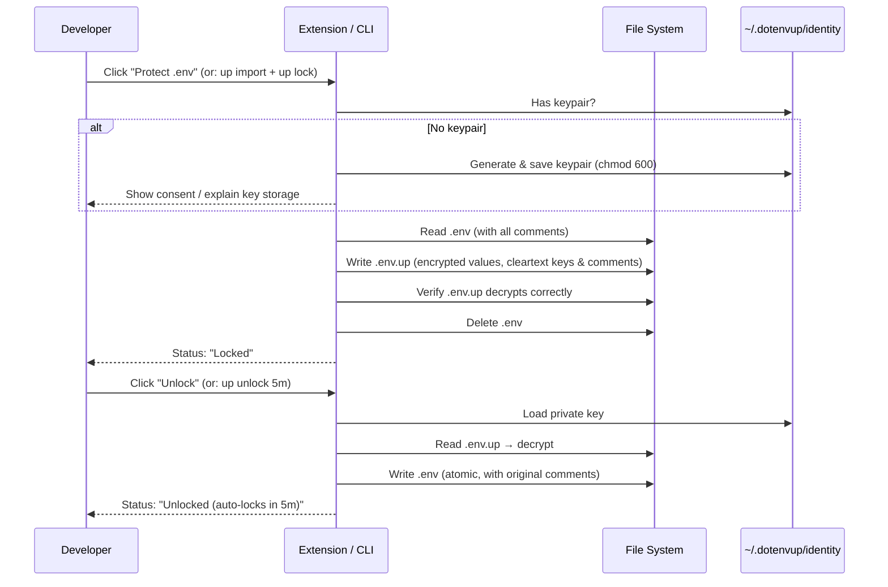
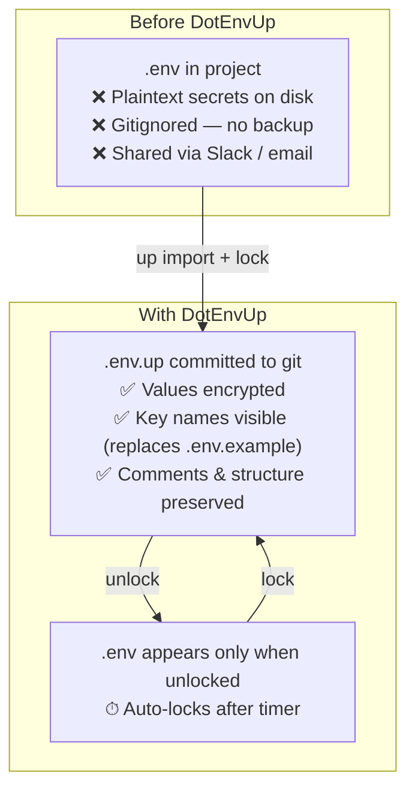
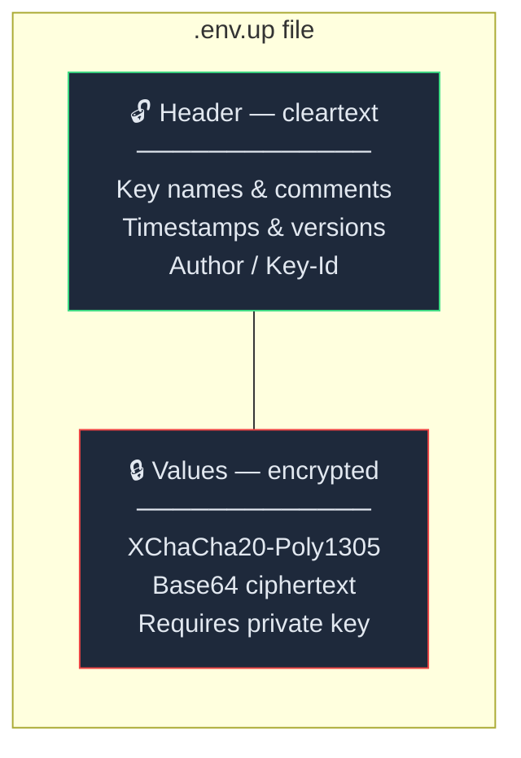
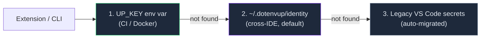

<p align="center">
  
</p>

# DotEnvUp

> `.env` files, but with memory — and a lock.

An encrypted `.env` file format (`.env.up`) and tooling that makes secrets safe by default — without changing how developers work.

- **Encrypted at rest** — values, comments, and structure are encrypted on disk. No more plaintext secrets.
- **Comments preserved** — your `# Database`, blank lines, and commented-out secrets survive encrypt/decrypt.
- **Metadata you've always wanted** — each key tracks its origin, timestamp, version, and author.
- **Lock/unlock** — one button to decrypt temporarily. Auto-locks when you're done.
- **Zero code changes** — existing `dotenv` libraries, `process.env`, everything works unchanged.
- **Safe to commit** — `.env.up` files can live in git. Only metadata is visible, values are encrypted.
- **Cross-IDE** — keys at `~/.dotenvup/identity` work across VS Code, Cursor, CLI, and any tool.

For seamless team sharing: **[unknownpassword.com](https://unknownpassword.com)**.

## How It Works



### Before & After



## Packages

| Package | Description | npm |
|---|---|---|
| [`@dotenvup/format`](./packages/format) | Core `.env.up` format parser & writer | [](https://www.npmjs.com/package/@dotenvup/format) |
| [`@dotenvup/node`](./packages/node) | Drop-in `dotenv` replacement for Node.js | [](https://www.npmjs.com/package/@dotenvup/node) |
| [`@dotenvup/cli`](./packages/cli) | CLI tool (`up lock`, `up unlock`, `up run`) | [](https://www.npmjs.com/package/@dotenvup/cli) |
| [DotEnvUp Extension](./packages/vscode-dotenvup) | VS Code / Cursor extension — local secret management | [Download .vsix (v0.3.0)](https://github.com/sarhej/dotenvup/releases/download/v0.3.0/dotenvup-0.3.0.vsix) |

## The `.env.up` Format

An encrypted `.env` with visible metadata — a "half-open envelope":



```ini
#!dotenvup v1
# Encrypted-By: @alice
# Encrypted-For: @bob, @charlie

[keys]
DB_HOST          v3  2026-02-10T08:00:00Z  @alice    staging cluster
DB_PASSWORD      v5  2026-02-15T10:30:00Z  @alice    # rotated
API_KEY          v2  2026-02-01T00:00:00Z  @alice    test key

[encrypted]
recipient:@bob    nonce:abc123... payload:SGVsbG8g...
```

You can see **what's inside** (key names, versions, timestamps) without decrypting. The actual values — and the original `.env` content including all comments — are encrypted per-recipient.

**Full details:** [Security Model](docs/SECURITY.md) · [User Guide](docs/USER_GUIDE.md)

## Key Storage

Keys are stored at `~/.dotenvup/identity` — works across every IDE and the CLI.



## Documentation

- [User Guide](docs/USER_GUIDE.md) — Commands, workflows, drift explained
- [Troubleshooting](docs/TROUBLESHOOTING.md) — Common errors, identity file and recovery issues
- [Security Model](docs/SECURITY.md) — What is encrypted, threat model
- [File Type Registration](docs/FILE_TYPE.md) — MIME types, UTI, icons for OS integration
- [Roadmap](docs/ROADMAP.md) — Extension hardening, native installers, OS file type registration
- [Publishing to the Marketplace](docs/PUBLISHING.md) — How to publish the VS Code extension (maintainers)

## Install

### VS Code / Cursor Extension (recommended)

Download the `.vsix` from [Releases](https://github.com/sarhej/dotenvup/releases) ([v0.3.0](https://github.com/sarhej/dotenvup/releases/tag/v0.3.0)), then:

```bash
# VS Code
code --install-extension dotenvup-0.3.0.vsix

# Cursor
cursor --install-extension dotenvup-0.3.0.vsix
```

Or in the editor: **Extensions** → `...` menu → **Install from VSIX...** → select the file.

Once installed, click the status bar button to protect your `.env` — no CLI needed.

### CLI

```bash
npm install -g @dotenvup/cli
```

## Quick Start

### Extension (one click)

1. Open a project that has a `.env` file
2. Click the **lock icon** in the status bar (bottom-right)
3. First time: consent screen explains key storage → click **"Protect My .env"**
4. Done — `.env` is encrypted into `.env.up` and deleted

To unlock: click the status bar again → choose a duration → `.env` reappears.

### CLI

```bash
up init            # Generate keypair (stored at ~/.dotenvup/identity)
up import .env     # Encrypt .env → .env.up (comments preserved!)
up lock            # Delete plaintext .env
up unlock 5m       # Decrypt for 5 minutes (with original comments)
up run -- npm start  # Run with decrypted env vars (no file on disk)
```

## Automation and AI Agents

Use `up run -- <command>` to run any command with decrypted env vars — no `.env` file is written to disk.

```bash
up run -- npm test
up run -- npm start
up status --json        # Machine-readable lock state
```

For scripts, CI, and AI coding agents, see **[AGENTS.md](AGENTS.md)**.

Agent-specific context files: **[CLAUDE.md](CLAUDE.md)** (Claude Code), **[GEMINI.md](GEMINI.md)** (Google Gemini).

## Development

```bash
npm install
npm run build
npm run test    # 110 tests across format, safety, and crypto
```

## License

MIT — see [LICENSE](./LICENSE).
