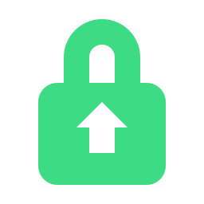
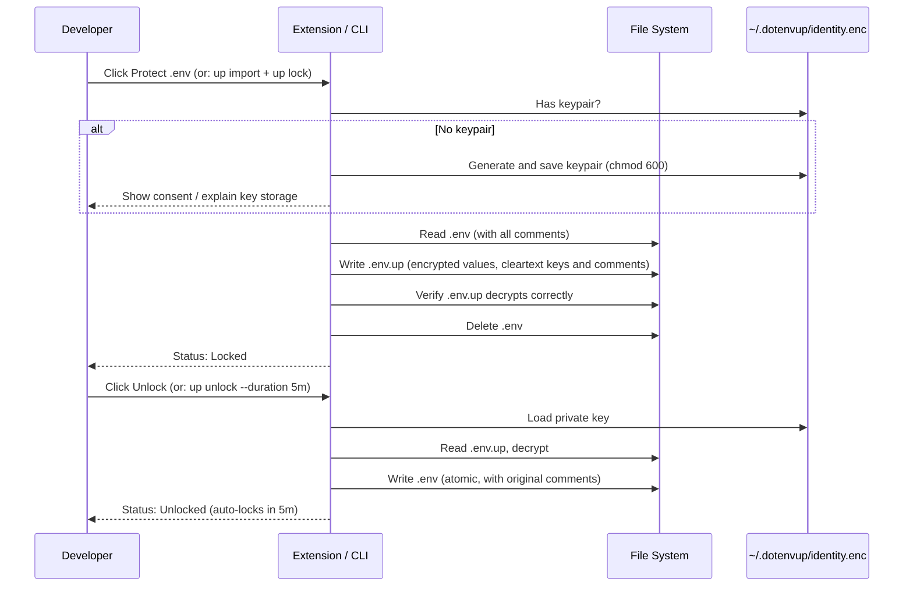
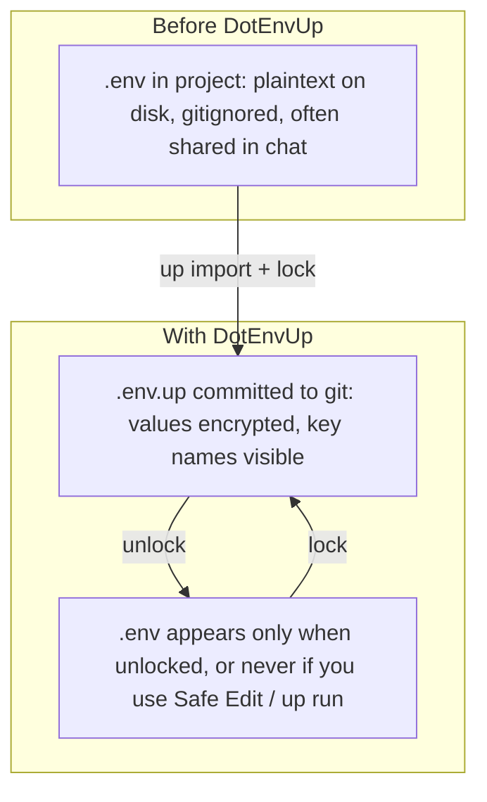
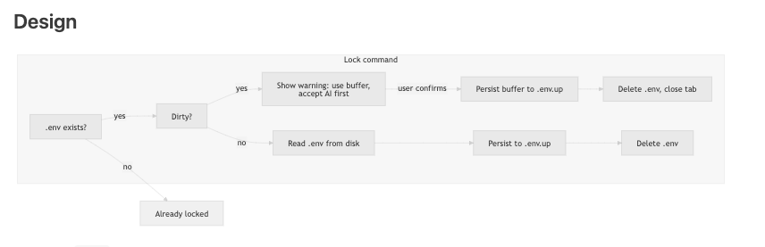
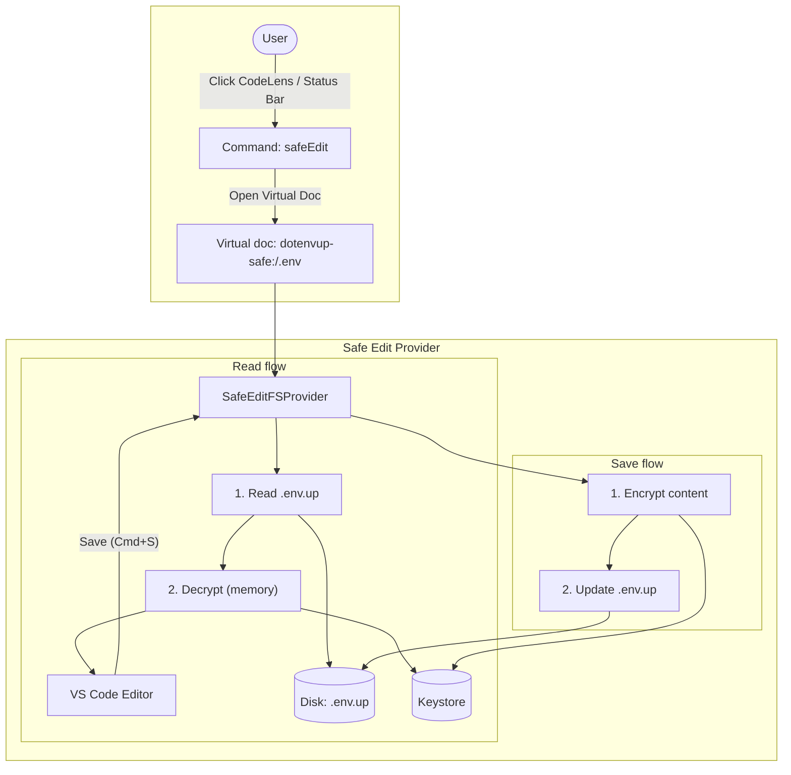
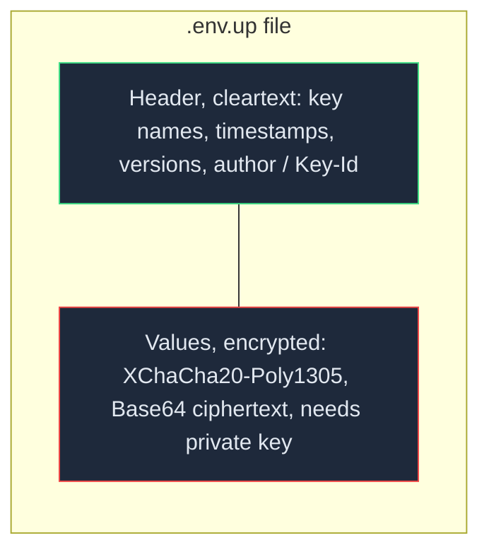
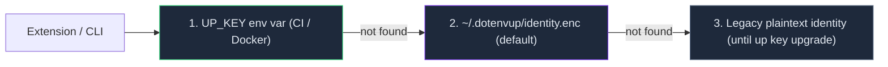

<p align="center">
  
</p>

# DotEnvUp

Encrypted `.env` for teams. Each teammate decrypts only what `[policy]` allows. Works inside VS Code and Cursor.

No server. Keys are generated on your machine and never leave it. GitHub stores the encrypted file. GitHub cannot read it.

Commit `.env.up`. Delete `.env`. Values are encrypted at rest.

Key names and per-key metadata (origin, timestamp, author) stay readable. Values do not. If your key names are themselves sensitive, this format is not for you.

CLI: `npm i -g @dotenvup/cli`. Extension ID: `dotenvup.dotenvup`. Optional team directory: [unknownpassword.com](https://unknownpassword.com).

## What this does not protect against

The full threat model is [docs/SECURITY.md](docs/SECURITY.md), also at [https://dotenvup.com/security](https://dotenvup.com/security). Short version:

- Any process running as the same user can read the injected environment, including via `/proc/<pid>/environ` on Linux. `up run -- <cmd>` does not hide secrets from the command it runs, and it does not hide them from a coding agent running as you. What it prevents is a plaintext file sitting on disk waiting to be read or committed. Accidental file ingestion and accidental git commit are the failures this tool is built to stop. It does not claim more.
- Key names and metadata are cleartext in `.env.up` (same class of leak as SOPS YAML keys and age recipient stanzas).
- The DotEnvUp implementation has not been independently audited. The primitives are X25519 and XChaCha20-Poly1305, the same hybrid construction [age](https://github.com/FiloSottile/age) uses, chosen because they are boring and reviewed rather than novel.
- Warm session is about 30 minutes idle and 8 hours absolute. Wipe on screen lock, sleep, or logout is implemented only on macOS, and only when the Keychain helper's `watch-presence` is installed. It is not implemented on Linux or Windows. We have not published a measured test of every Mac sleep path.
- Decrypted values in memory can reach swap or a crash dump. That is not mitigated (`mlock` is not used).
- Stolen laptop, default file envelope: anyone who can read `identity.enc` and `wrapping-key` under `~/.dotenvup/` can decrypt. Opt-in macOS Keychain is harder when the Mac is off or at the lock screen. An unlocked session, or malware as you, still sees secrets the same way as the same-user case above.

## Compared with dotenvx, SOPS, age, and Doppler

Facts re-checked in August 2026. Tools change. Check their docs before you choose.

| | DotEnvUp | [dotenvx](https://dotenvx.com) | [SOPS](https://github.com/getsops/sops) | [age](https://github.com/FiloSottile/age) | [Doppler](https://www.doppler.com) |
|---|---|---|---|---|---|
| Encrypt in the repo | Yes (`.env.up`) | Yes (encrypted `.env`) | Yes | Yes (any file) | No. Secrets live on Doppler's servers. |
| Multiple recipients per person | Yes. One file, many X25519 recipient blocks. | No. One private key per environment file (`.env.keys` / `DOTENV_PRIVATE_KEY`), shared with whoever should decrypt that file. Docs invite contact for other curves. | Yes (age, PGP, or KMS keys) | Yes (`-r` / `-R`, many recipients) | Accounts and roles, not recipients inside a committed file. |
| Per-key access policy | Yes. Cleartext `[policy]` lists which **values** each person gets. | No | Not per `.env` key name the way `[policy]` works | No (whole file) | Yes, via hosted ACLs |
| Editor GUI | Yes. Extension `dotenvup.dotenvup` (lock/unlock, Safe Edit, recipients). | Yes. Extension `dotenv.dotenvx-vscode` (decrypt toggle in the editor). | Yes, community editors (for example vscode-sops) | No first-party editor | Yes (web app) |
| Agent / MCP | Yes. `@dotenvup/mcp` plus a Cursor/Claude skill. | No first-party MCP we found | No first-party MCP we found | No | Hosted API and CLI. No first-party MCP we found. |
| Server required | No | No | No, unless you use cloud KMS | No | Yes |
| Independently audited | No | No public independent audit we verified | No public independent audit we verified | age is a widely reviewed tool. That is not an audit of DotEnvUp. | Doppler publishes SOC 2 Type II and ISO 27001 for the hosted product. |

dotenvx is the closest encrypt-and-commit tool. It is written by the creator of dotenv. The gap DotEnvUp fills is per-person recipients plus `[policy]`, plus a Cursor/VS Code workflow that includes lock/unlock, Safe Edit, and MCP. dotenvx already has an editor extension. Do not pretend it does not.

Hosted managers (Doppler, Infisical, and similar) win on rotation, revocation, and audit logging. DotEnvUp does not do those. If you need a receipt of who read a secret last Tuesday, use a hosted manager.

SOPS and age leak key names (or recipient identities) in the same way DotEnvUp does. The half-open envelope is not unique. It is disclosed on purpose.

## How It Works


```mermaid
sequenceDiagram
    participant Dev as Developer
    participant Ext as Extension / CLI
    participant FS as File System
    participant Key as ~/.dotenvup/identity.enc

    Dev->>Ext: Click Protect .env (or: up import + up lock)
    Ext->>Key: Has keypair?
    alt No keypair
        Ext->>Key: Generate and save keypair (chmod 600)
        Ext-->>Dev: Show consent / explain key storage
    end
    Ext->>FS: Read .env (with all comments)
    Ext->>FS: Write .env.up (encrypted values, cleartext keys and comments)
    Ext->>FS: Verify .env.up decrypts correctly
    Ext->>FS: Delete .env
    Ext-->>Dev: Status: Locked

    Dev->>Ext: Click Unlock (or: up unlock --duration 5m)
    Ext->>Key: Load private key
    Ext->>FS: Read .env.up, decrypt
    Ext->>FS: Write .env (atomic, with original comments)
    Ext-->>Dev: Status: Unlocked (auto-locks in 5m)
```

### Before and after


```mermaid
graph TD
    subgraph "Before DotEnvUp"
        A[".env in project: plaintext on disk, gitignored, often shared in chat"]
    end
    subgraph "With DotEnvUp"
        B[".env.up committed to git: values encrypted, key names visible"]
        C[".env appears only when unlocked, or never if you use Safe Edit / up run"]
    end
    A -->|"up import + lock"| B
    B -->|"unlock"| C
    C -->|"lock"| B
```

### Lock command flow

Lock always persists the current `.env` into `.env.up` and removes `.env`. If the file has unsaved changes in the editor, a warning explains that the **current editor content** will be used and that unaccepted AI or other edits should be accepted first.



### Safe Edit

Edit `.env.up` in place via a **virtual document**. No plaintext `.env` on disk. Open from CodeLens/status bar, edit, save. The extension decrypts for the editor and re-encrypts on save.


```mermaid
flowchart TB
    subgraph Initiation[" "]
        User([User])
        User -->|"Click CodeLens / Status Bar"| Cmd["Command: safeEdit"]
        Cmd -->|"Open Virtual Doc"| Virtual["Virtual doc: dotenvup-safe:/.env"]
    end

    subgraph Provider["Safe Edit Provider"]
        Editor["VS Code Editor"]
        FS["SafeEditFSProvider"]
        Disk[("Disk: .env.up")]
        Key[(Keystore)]

        Virtual --> FS

        subgraph Read["Read flow"]
            R1["1. Read .env.up"]
            R2["2. Decrypt (memory)"]
            FS --> R1 --> Disk
            R1 --> R2 --> Key
            R2 --> Editor
        end

        subgraph Save["Save flow"]
            S1["1. Encrypt content"]
            S2["2. Update .env.up"]
            Editor -->|"Save (Cmd+S)"| FS
            FS --> S1 --> Key
            S1 --> S2 --> Disk
        end
    end
```

Full flow (read/save sequences): [Safe Edit design](docs/design/SAFE_EDIT_FLOW.md).

## Packages

| Package | Description | npm |
|---|---|---|
| [`@dotenvup/format`](./packages/format) | Core `.env.up` format parser and writer | [](https://www.npmjs.com/package/@dotenvup/format) |
| [`@dotenvup/node`](./packages/node) | Drop-in `dotenv` replacement for Node.js | [](https://www.npmjs.com/package/@dotenvup/node) |
| [`@dotenvup/cli`](./packages/cli) | CLI tool (`up lock`, `up unlock`, `up run`) | [](https://www.npmjs.com/package/@dotenvup/cli) |
| [DotEnvUp Extension](./packages/vscode-dotenvup) | VS Code / Cursor extension | [Marketplace](https://marketplace.visualstudio.com/items?itemName=dotenvup.dotenvup) · [Open VSX](https://open-vsx.org/extension/dotenvup/dotenvup) · [.vsix](https://github.com/sarhej/dotenvup/releases) |
| [@dotenvup/mcp](./packages/dotenvup-mcp) | MCP server: status, keys, run (for Cursor/AI) | `npx -y @dotenvup/mcp`; [design](docs/design/MCP_SERVER.md) |
| [@dotenvup/secret-generator](./packages/secret-generator) | Password / passphrase generator (Web Crypto, EFF wordlist) | In-repo; npm publish when ready |

**Local identity:** encrypted `identity.enc` (plus recovery). Existing users: `up key upgrade`. **Opt-in macOS Keychain** (`up key migrate-to-keychain`) and session agent: see [docs/design/KEYCHAIN_TOUCHID.md](docs/design/KEYCHAIN_TOUCHID.md). Not Touch ID by default.

**Cross-repo duty:** Changing `packages/secret-generator` requires **[docs/SECRET_GENERATOR_SYNC.md](./docs/SECRET_GENERATOR_SYNC.md)** (UnknownPassword mirror + vendor). Cursor **`project-context.mdc`** enforces this.

## The `.env.up` Format ([Open Standard (v1)](docs/FORMAT_SPEC.md))

An encrypted `.env` with visible metadata. A half-open envelope:


```mermaid
graph LR
    subgraph ".env.up file"
        H["Header, cleartext: key names, timestamps, versions, author / Key-Id"]
        V["Values, encrypted: XChaCha20-Poly1305, Base64 ciphertext, needs private key"]
    end
    H --- V
    style H fill:#1e293b,stroke:#3DDC84,color:#e2e8f0
    style V fill:#1e293b,stroke:#ef4444,color:#e2e8f0
```

```ini
#!dotenvup v1
# Encrypted-By: @alice
# Encrypted-For: @bob, @charlie

[keys]
DB_HOST          v3  2026-02-10T08:00:00Z  @alice    staging cluster
DB_PASSWORD      v5  2026-02-15T10:30:00Z  @alice    # rotated
API_KEY          v2  2026-02-01T00:00:00Z  @alice    test key

[encrypted]
recipient:@bob    nonce:abc123... payload:SGVsbG8g...
```

You can see key names, versions, and timestamps without decrypting. The values, and the original `.env` content including comments, are encrypted per recipient.

**Full details:** [Format Spec](docs/FORMAT_SPEC.md) · [Security Model](docs/SECURITY.md) · [User Guide](docs/USER_GUIDE.md) · [Changelog](CHANGELOG.md)

## Key Storage

Default: `~/.dotenvup/identity.enc` plus a wrapping key. Works across every IDE and the CLI. Override with `UP_KEY` / `DOTENVUP_PRIVATE_KEY` in CI.


```mermaid
flowchart LR
    App["Extension / CLI"] --> E
    E["1. UP_KEY env var (CI / Docker)"]
    E -->|not found| F["2. ~/.dotenvup/identity.enc (default)"]
    F -->|not found| L["3. Legacy plaintext identity (until up key upgrade)"]
    style E fill:#1e293b,stroke:#3DDC84,color:#e2e8f0
    style F fill:#1e293b,stroke:#7c3aed,color:#e2e8f0
    style L fill:#1e293b,stroke:#64748b,color:#e2e8f0
```

## Documentation

- **[Format Specification (v1)](docs/FORMAT_SPEC.md)**: the `.env.up` open standard
- [User Guide](docs/USER_GUIDE.md): commands, workflows, drift
- [Security Model](docs/SECURITY.md): what is encrypted, what is not
- [Changelog](CHANGELOG.md)
- [Troubleshooting](docs/TROUBLESHOOTING.md): common errors, identity and recovery
- [File Type Registration](docs/FILE_TYPE.md)
- [Roadmap](docs/ROADMAP.md)
- [Publishing to the Marketplace](docs/PUBLISHING.md) (maintainers)

## Install

Needs Node.js and npm. No prior `up init` is required. The commands below create the keypair.

### VS Code / Cursor extension (recommended)

**Extension ID:** `dotenvup.dotenvup`. Install from the **[VS Code Marketplace](https://marketplace.visualstudio.com/items?itemName=dotenvup.dotenvup)** or **[Open VSX](https://open-vsx.org/extension/dotenvup/dotenvup)** (Cursor, VSCodium). In the editor: Extensions, search `.env` or `DotEnvUp`, or paste the extension ID. Display name: `.env Up (DotEnvUp)`.

If search does not find it, use the links above or see [AGENTS.md](AGENTS.md#discoverability-for-other-agents-and-chats). Or download a [.vsix from Releases](https://github.com/sarhej/dotenvup/releases) and use Extensions, `...`, Install from VSIX.

Once installed, open a folder that contains a `.env`, then click the status bar lock. First run shows a consent screen and writes `~/.dotenvup/`. No CLI needed.

### CLI (copy-paste)

```bash
npm install -g @dotenvup/cli
up init
# save the recovery code it prints. then, in a directory that has a .env:
up import .env
up lock --yes
up keys                 # names only, no values
up status
```

`up init` writes `~/.dotenvup/identity.enc`. `up import .env` fails if `.env` is missing; create one first. `up lock --yes` deletes `.env` after the encrypted file verifies.

## Quick Start

### Extension (one click)

1. Open a project that has a `.env` file
2. Click the lock icon in the status bar (bottom-right)
3. First time: consent screen explains key storage. Click **Protect My .env**
4. Done. `.env` is encrypted into `.env.up` and deleted

To unlock: click the status bar again, choose a duration, `.env` reappears.

### CLI

```bash
up init                 # keypair at ~/.dotenvup/ (identity.enc)
up import .env          # encrypt .env into .env.up
up lock --yes           # delete plaintext .env
up unlock --duration 5m # write .env for 5 minutes
up run -- npm start     # inject env, no .env on disk
```

## Automation and AI Agents

Use `up run -- <command>` to run any command with decrypted env vars. No `.env` file is written to disk. The command, and any other process running as you, can still read those variables.

```bash
up run -- npm test
up run -- npm start
up status --json        # lock state, no secret values
```

For scripts, CI, and AI coding agents, see **[AGENTS.md](AGENTS.md)**.

Agent-specific context files: **[CLAUDE.md](CLAUDE.md)** (Claude Code), **[GEMINI.md](GEMINI.md)** (Google Gemini). **Claude Code plugin:** add this repo as a marketplace and install the dotenvup plugin. See [docs/CLAUDE_CODE.md](docs/CLAUDE_CODE.md#how-claude-users-can-discover-and-install). **Cursor plugin:** this repo is also a Cursor plugin bundling the DotEnvUp skill. See [docs/CURSOR.md](docs/CURSOR.md).

## Development

```bash
npm install
npm run build
npm test
```

## Backlog

Planned work (not yet scheduled):

- **Kubernetes controller:** cluster-side controller that decrypts `.env.up` and creates a standard Kubernetes `Secret`. Same idea as [Sealed Secrets](https://github.com/bitnami-labs/sealed-secrets): one format for local dev and GitOps in-cluster.
- **MCP:** **Implemented.** [@dotenvup/mcp](packages/dotenvup-mcp) exposes `dotenvup_status`, `dotenvup_keys`, and `dotenvup_run`. Use **DotEnvUp: Copy MCP config for Cursor**, or see [docs/design/MCP_SERVER.md](docs/design/MCP_SERVER.md).
- **Lock for Agent:** explicit guidance so agents never persist plaintext `.env`; use `up run --`.
- **Ready-to-use CI/CD:** GitHub Actions, GitLab CI, and shell scripts that use `up run --` or `UP_KEY`, with no plaintext `.env` in logs.

See [Roadmap](docs/ROADMAP.md) for current priorities.

## License

MIT. See [LICENSE](./LICENSE).
