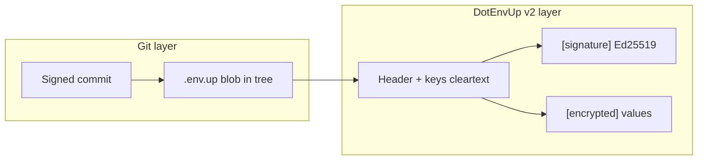

# DotEnvUp Format v2 — Design exploration

> **Status:** Draft for discussion — **not implemented**.  
> **Audience:** format maintainers, CLI/extension implementers, UnknownPassword alignment.  
> **v1 remains stable:** v2 is additive; existing `.env.up` files keep working.

---

## 1. Why consider v2 now

v1 is **stable and shipped** (`@dotenvup/format`, CLI, extension 0.6.5). Since v1 was frozen, the ecosystem around it grew:

| Shipped (tooling, not format) | Implication for v2 |
|------------------------------|-------------------|
| Identity envelope + recovery (`identity.enc`) | Strong local identity; v2 can bind signatures to **Key-Id** |
| macOS Keychain / session agent (opt-in) | Signing should work with warm session; no extra Touch ID per import |
| MCP + Cursor skill + agent rules | Agents need **machine-readable policy**, not just human docs |
| CLI-token wrapper pattern (`scripts/cli.sh`) | **Tooling**, not format — but v2 can tag keys as `kind:cli-token` in cleartext |
| GitHub SSH → X25519 recipient bridge | Same **identity family** as `git commit -S`; v2 can link authors to `github:user` |
| Cleartext metadata audit (`author`, `version`, timestamps) | Works — but metadata can be **edited without the private key** |

The main **format gap** v1 leaves open: an attacker with repo write access can change cleartext `[keys]` rows (fake `@alice`, bump `version`, add phantom keys) without decrypting. Values stay encrypted; **audit trail integrity** does not.

Git **commit signing** addresses a different layer (who committed the blob). v2 should **complement** git, not replace it.

---

## 2. Goals and non-goals

### Goals

1. **Tamper-evident cleartext metadata** — detect edits to header + `[keys]` without valid signature.
2. **Stronger, verifiable authorship** — tie `author` / `Encrypted-By` to a key humans already trust (DotEnvUp Key-Id and/or git SSH identity).
3. **Activate reserved v1 fields** where they clearly help (`env` column, `Repository` binding).
4. **Agent-safe hints in cleartext** — key **kind** (app secret vs CLI token vs CI) so skills don’t guess.
5. **Backward compatible** — v1 parsers keep working; v2 is opt-in on write.

### Non-goals (v2)

| Item | Where it lives instead |
|------|------------------------|
| CLI-token wrapper / `railway login` refusal | `scripts/cli.sh`, skills, Cursor rules |
| Encrypting key names (full envelope) | Breaks “half-open” UX; not planned |
| Replacing git commit signing | Git remains source of truth for **commits** |
| Cloud recipient directory / team governance | UnknownPassword commercial layer |
| New encryption algorithm by default | Stay `x25519-xchacha20-poly1305` unless v2.1 agility is needed |
| Mandatory v2 migration | v1 files valid indefinitely |

---

## 3. Design principles

1. **Half-open envelope stays** — key names, versions, authors, kinds remain visible in git diffs.
2. **Sign what is cleartext** — signature covers header + `[keys]` only, not `[encrypted]` (ciphertext already has Poly1305 MAC).
3. **Verify locally** — `up verify`; no server.
4. **Same identity directory** — `~/.dotenvup/`; optional signing subkey alongside encryption key.
5. **Parsers forward-compatible** — unknown sections ignored (v1 behavior preserved).

---

## 4. Proposed v2 file shape

Magic line bumps; new section between `[keys]` and `[encrypted]`:

```ini
#!dotenvup v2
# Encrypted-By: github:alice-dev
# Created: 2026-08-24T20:00:00Z
# Algorithm: x25519-xchacha20-poly1305
# Encrypted-For: @alice, @ci
# Key-Id: 066g6-qvv3E
# Repository: https://github.com/acme/my-app
# Repo-Id: sha256:abc...   # optional fingerprint of normalized remote URL

[keys]
DB_HOST           v1  2026-08-20T10:00:00Z  @alice           dev    app
RAILWAY_API_TOKEN v1  2026-08-24T19:00:00Z  @alice           prod   cli-token
GH_TOKEN          v1  2026-08-24T19:00:00Z  @alice           prod   cli-token

[signature]
algorithm: ed25519
signed-by: github:alice-dev
signer-key-id: K7x9m2pQ4nRt          # fingerprint of signing public key (not encryption Key-Id)
canonical-hash: blake2b-256:Base64...
signature: Base64...
signed-at: 2026-08-24T20:00:00Z

[provenance]
git-commit: a1b2c3d4e5f6...
git-tree:   .env.up
git-signed: true
git-signer: ssh-ed25519 AAAAC3...      # optional; from `git log --show-signature` when HEAD matches

[encrypted]
recipient:@alice  identity:github:alice-dev  nonce:...  ephemeral:...  payload:...
```

**Section order (v2):** Header → `[keys]` → `[signature]` → `[provenance]` (optional) → `[encrypted]`.

v1 parsers that stop at `[encrypted]` still work if we keep `[encrypted]` last; v1 generators that don’t emit new sections remain valid **unsigned v1**.

---

## 5. Feature tiers

### Tier A — Recommended “v2.0” (format + CLI)

#### A1. Header + keys signature (`[signature]`)

Implements the v1-reserved field properly.

| Field | Purpose |
|-------|---------|
| `canonical-hash` | BLAKE2b-256 over a **canonical UTF-8** serialization of header comments (sorted keys) + normalized `[keys]` body (LF, trimmed trailing spaces per line) |
| `signature` | Ed25519 detached signature over `canonical-hash` bytes |
| `signed-by` | Human/agent identity (`github:alice`, nickname, or `key-id:…`) |
| `signer-key-id` | Short fingerprint of **signing** public key (may differ from encryption `Key-Id`) |

**Commands:**

- `up import` — sign on write when signing key available (`--no-sign` to opt out).
- `up verify [.env.up]` — exit `0` if signature valid; `1` if missing/invalid; JSON mode for CI.
- Extension — status bar / Key Management: “metadata signed ✓” vs “unsigned (v1)”.

**Crypto note:** DotEnvUp identity today is **X25519-only**. v2 should add an **Ed25519 signing subkey** at `up init` / `up key upgrade` (same recovery bundle; new optional field in identity envelope). Reuse `packages/format/src/sshKeys.ts` patterns for GitHub SSH as an **alternate** signer at import time (see A3).

#### A2. Key `env` column (activate v1 reserved)

Sixth column in `[keys]`:

```ini
API_KEY  v3  2026-08-24T12:00:00Z  @bob  staging  app
```

| `env` value | Meaning |
|-------------|---------|
| `dev`, `staging`, `prod`, … | Deployment target tag |
| `*` or empty | Default / all environments |

Parsers: optional column; v1 rows without `env` remain valid.

#### A3. Key `kind` column (new, cleartext)

Seventh column — **agent and human policy**, not access control:

| `kind` | Meaning | Example keys |
|--------|---------|----------------|
| `app` | Application runtime secret | `DATABASE_URL`, `JWT_SECRET` |
| `cli-token` | Third-party CLI API token | `RAILWAY_API_TOKEN`, `GH_TOKEN` |
| `ci` | CI-only machine identity | `DEPLOY_KEY` |
| `public` | Documented non-secret (rare in `.env.up`) | placeholder for migrated `.env.example` entries |

Agents: “never run bare `gh` if `GH_TOKEN` is `kind:cli-token` and missing” — aligns with skills without hard-coding Railway.

**Optional:** generator warns on `VITE_*` + `kind:app` mismatch (client-bundled risk).

#### A4. Structured `author` / `Encrypted-By`

v1 allows free-form `@alice`. v2 **recommends** verifiable forms:

| Form | Verifiable how |
|------|----------------|
| `github:username` | Matches `identity:` on recipient block; SSH key fetch |
| `key-id:066g6-qvv3E` | Matches encryption Key-Id |
| `@nickname` | Legacy / display only (unsigned author) |

Signing with A1 makes `author` tamper-evident even for nicknames.

---

### Tier B — Git provenance (optional section)

**Not** a substitute for commit signing. Records context at **import/lock** time:

```ini
[provenance]
git-commit: <sha>
git-ref: main
git-signed: true|false
git-signer: <ssh fingerprint or gpg key id>
imported-by: up@0.3.0
```

**Tooling (policy, not crypto):**

- `up doctor` — warn if `.env.up` changed in working tree vs last signed commit.
- `up import --require-signed-commit` — refuse import unless `HEAD` commit is signed (team policy).
- `up verify --provenance` — check `git-commit` still exists in history (best-effort).

Cleartext provenance is **hint + policy**; a malicious writer can lie. Pair with A1 signature + git signed commits for defense in depth.

---

### Tier C — Tooling ecosystem (parallel to format)

Ship with or shortly after v2 format support; **no magic line change required**:

| Deliverable | Role |
|-------------|------|
| `scripts/cli.sh` (reference) | CLI tokens without personal login |
| `up doctor` | identity, `.env.up` verify, gitignore, unsigned metadata, provenance |
| MCP `dotenvup_verify` | Agents check signature without seeing values |
| Pre-commit / CI snippet | `up verify && git diff --exit-code .env.up` |
| Consumer Cursor rule | `cli-tokens-dotenvup.mdc` copy pattern |

---

### Tier D — Defer (v2.1+)

| Idea | Why defer |
|------|-----------|
| Per-recipient sidecar `.env.up.<recipient>` | v1 note; nice for large teams |
| Single envelope for `.env` + `.env.production` | ROADMAP 3.3; UX-heavy |
| Post-quantum / algorithm agility header | No urgent threat; big interop cost |
| Encrypted metadata mode | Conflicts with half-open envelope |
| UnknownPassword online recipient sync | Commercial; keep OSS offline |

---

## 6. Relationship to git commit signing



| Question | Git commit sign | DotEnvUp v2 sign |
|----------|-----------------|------------------|
| Who committed this file? | Yes | No (use `[provenance]` hint) |
| Who rotated `API_KEY` per metadata? | No | Yes (signed `[keys]`) |
| Can attacker rewrite `@alice` in header? | Commits new blob; needs their signature | Invalidates `[signature]` |
| Protects secret values? | No | Yes (encryption, unchanged) |

**Recommended story for users:**  
Sign commits **and** use v2 metadata signatures. Optional: same SSH key for git sign and DotEnvUp `signer` (convenience, not requirement).

---

## 7. Identity model (signing subkey)

**Proposal:** extend local identity bundle:

```
~/.dotenvup/
  identity.enc          # encryption private key (X25519) — unchanged
  identity.sign.pub     # Ed25519 signing public key (new, optional)
  signing-key.enc       # Ed25519 signing private key, wrapped like identity (new)
```

- `up init` (v2-aware) creates both; `up key upgrade` adds signing subkey to existing users.
- `signer-key-id` = BLAKE2b-8 of signing public key (same style as `Key-Id`).
- Recovery bundle includes signing subkey.
- **Opt-out:** `up import --no-sign` writes v2 file without `[signature]` (discouraged; `up verify` warns).

**Alternative (lighter v2.0):** sign only with **SSH key used for git** at import time (`ssh-keygen -Y sign -f ~/.ssh/id_ed25519`). No identity change; signature block records `signer: ssh-ed25519 …`. Good for “same person who signs commits”; worse for CI headless import.

**Decision needed:** default signer = DotEnvUp subkey, git SSH, or user choice?

---

## 8. Security model delta

| Capability | v1 | v2 (Tier A) | v2 + Tier B |
|------------|----|-------------|-------------|
| Read values without private key | Blocked | Blocked | Blocked |
| Tamper ciphertext | Detected (MAC) | Detected | Detected |
| Tamper cleartext metadata | **Not detected** | **Detected** (signature) | Detected |
| Fake author in `[keys]` | Possible | Invalidates signature | Invalidates signature |
| Lie about git commit in provenance | N/A | N/A | Possible (policy tools only) |
| Agent runs CLI with project token | Tooling | `kind:cli-token` hint | Same |

---

## 9. Migration and compatibility

| Action | Behavior |
|--------|----------|
| Read v1 file | Unchanged |
| Read v2 unsigned | Treat as v1-equivalent; warn |
| Read v2 signed | Verify optional on decrypt path |
| Write new file | Default v2 signed when signer available |
| `up format upgrade .env.up` | Bump magic, add `[signature]`, optional `[provenance]` |
| Downgrade v2 → v1 | Strip `[signature]` / `[provenance]`; lose tamper evidence |

**npm:** v2 is **`@dotenvup/format` minor/major** + CLI/extension releases — not a separate product.

Suggested version bump when implemented:

- `@dotenvup/format` **0.3.0** (or **1.0.0** if we declare format stable)
- `@dotenvup/cli` **0.3.0** (`verify`, sign on import)
- Extension **0.7.0** (verify UI)

---

## 10. Implementation order (when approved)

1. **Spec addendum** — `docs/FORMAT_SPEC_V2.md` (normative); keep v1 doc frozen.
2. **`@dotenvup/format`** — canonical serialization, `[signature]` parse/write, `verifyHeaderSignature()`.
3. **Identity signing subkey** — `up init` / `up key upgrade` (or SSH-only MVP).
4. **CLI** — sign on `import`, `up verify`, `up format upgrade`.
5. **Extension** — unsigned badge, verify on lock.
6. **Docs/skills** — agents: “prefer signed `.env.up`; run `up verify` in CI”.
7. **Tier B** — `[provenance]` + `up doctor` (can trail v2.0 by one release).

---

## 11. Open decisions (need your call)

1. **MVP signer:** DotEnvUp Ed25519 subkey vs git SSH-only vs both?
2. **Signature required?** Strict (refuse v2 write without sign) vs warn-only?
3. **`kind` column:** Standard enum in spec vs free-form string?
4. **`[provenance]`:** In v2.0 or v2.1?
5. **Auto-upgrade on import:** Every `up import` rewrites to v2, or explicit `up format upgrade`?
6. **UnknownPassword:** Should commercial layer require v2 signatures for team audit?

---

## 12. What we are **not** putting in v2

- CLI login blocking (stays in `scripts/cli.sh` / skills).
- npm distribution of the wrapper.
- Replacing `.env.example` with encrypted-only workflow (unchanged).
- Server-side signature verification or centralized identity.

---

## 13. References

- [FORMAT_SPEC.md](../FORMAT_SPEC.md) — v1 stable
- [SECURITY.md](../SECURITY.md) — threat model
- [KEYCHAIN_TOUCHID.md](./KEYCHAIN_TOUCHID.md) — session/signing UX
- [MCP_SERVER.md](./MCP_SERVER.md) — agent verify tool fits Tier C
- [ROADMAP.md](../ROADMAP.md) — onboarding items complement v2 `kind` / `env`

---

*Next step after approval: normative `FORMAT_SPEC_V2.md` + prototype canonical hash in `@dotenvup/format` tests (no user-facing release until round-trip tests pass).*
