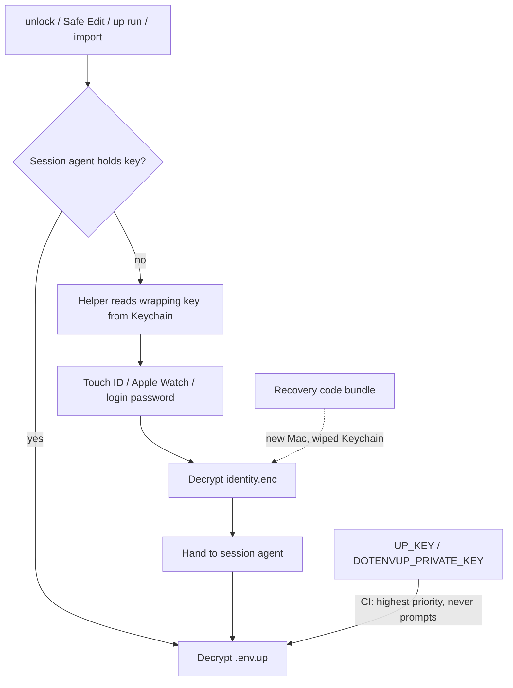
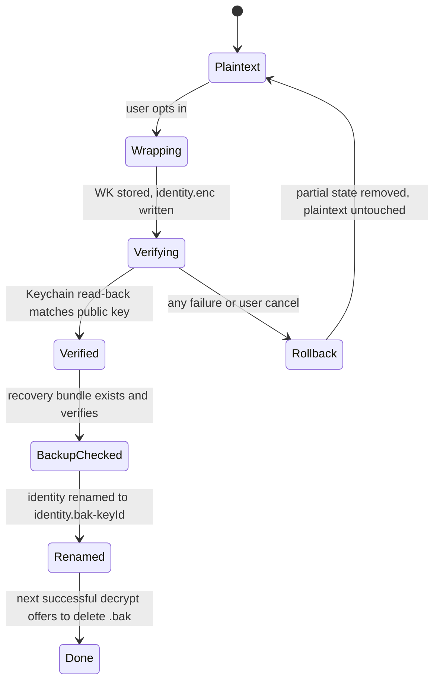

# macOS Touch ID and Keychain — Design

> **Goal:** On macOS, gate DotEnvUp's private key behind Touch ID / Apple Watch / login password, with roughly one prompt per working session — without making the Keychain a new way to lose keys.

Status: M0 approved. **M1 in progress** — file-wrapped `identity.enc` + auto recovery bundle at `up init` (no native helper yet).

Wireframes: [../designs/](../designs/) (see [Wireframes](#wireframes)).

**Cursor delivery:** The Cursor Marketplace plugin is a first-class surface for this feature (skill + bundled MCP). It does **not** reimplement Keychain — the signed CLI helper owns LocalAuthentication. The plugin makes agents unlock-aware and routes humans to the extension/CLI for the OS prompt. See [Cursor plugin surface](#cursor-plugin-surface).

## Why not "put the private key in the Keychain"

The obvious design — move `~/.dotenvup/identity` into the login Keychain with a biometry ACL — fails three ways:

1. **Biometry-gated items cannot sync and cannot be exported.** A wiped Keychain, a dead Mac, or a migration to a new machine would leave every existing `.env.up` permanently undecryptable. That is a *worse* failure mode than today's plaintext file.
2. **`kSecAccessControlBiometryCurrentSet` invalidates the item** when the user adds or removes a fingerprint. For a tool whose entire job is decrypting historical `.env.up` files, that is silent catastrophic loss.
3. **A prompt per operation is hostile to agents.** [AGENTS.md](../../AGENTS.md) actively instructs AI agents to run `up run -- <command>`. A modal biometric prompt on every invocation would stall agent loops and make the tool feel broken.

## Architecture: envelope

The Keychain stores a random **wrapping key**, never the identity itself. The identity lives encrypted on disk. A recovery code can always rebuild it.



| Asset | Location | Protection |
|---|---|---|
| Wrapping key (32 random bytes) | Keychain generic password | `UserPresence` ACL, `WhenUnlockedThisDeviceOnly` |
| Private identity | `~/.dotenvup/identity.enc` | XChaCha20-Poly1305 under the wrapping key |
| Public key | `~/.dotenvup/identity.pub` (unchanged) | Filesystem, `0644` |
| Recovery bundle | `~/.dotenvup/recovery/<keyId>.dotenvup-key` | scrypt + XChaCha20 under the recovery code |
| CI key | `UP_KEY` / `DOTENVUP_PRIVATE_KEY` | Unchanged; bypasses all of this |

### Envelope format (`identity.enc`)

```json
{
  "format": "dotenvup-identity-envelope",
  "version": 1,
  "keyId": "pBEsFwUPu2Q",
  "createdAt": "2026-07-25T20:00:00.000Z",
  "wrap": { "source": "keychain", "service": "com.dotenvup.wrapping-key", "account": "pBEsFwUPu2Q" },
  "cipher": { "name": "xchacha20-poly1305", "nonce": "<base64>", "ciphertext": "<base64>" }
}
```

- `wrap.source` is `keychain` on macOS after opt-in, or `file` (a `0600` wrapping-key file) elsewhere and before opt-in. The envelope format is identical either way, so M1 ships and works before any native code exists.
- AEAD additional data is `format | version | keyId`, binding the ciphertext to its envelope so a swapped header is rejected.
- The file is written atomically (`.tmp` then rename) and is mode `0600`.

### Keychain item

- Class: generic password. Service `com.dotenvup.wrapping-key`, account = Key-Id (so multiple identities can coexist after `up init --force`).
- Access control: **`kSecAccessControlUserPresence`**. macOS then accepts Touch ID, Apple Watch, or the login password, and the item survives biometric re-enrollment.
- Accessibility: `kSecAttrAccessibleWhenUnlockedThisDeviceOnly` — never leaves the device, never lands in an iCloud or unencrypted backup.

**Rejected alternatives:** `kSecAccessControlBiometryCurrentSet` (destroys the item on fingerprint change), `kSecAccessControlBiometryAny` (excludes Apple Watch and password fallback, so a Mac without Touch ID cannot participate), and `@napi-rs/keyring` (the keytar successor, but it exposes no ACL support at all).

## Helper binary

Touch ID requires Security.framework plus LocalAuthentication, which no Node keyring library exposes. We ship a small Swift binary rather than an FFI or node-gyp dependency, so `npm i -g @dotenvup/cli` can never fail with a compiler error.

- Package: `@dotenvup/keychain-darwin`, an optional dependency containing a universal (arm64 + x64) binary built with `swiftc -framework LocalAuthentication -framework Security`.
- Developer ID signed and notarized in the release workflow. This is mandatory, not cosmetic: the Keychain ACL is bound to the binary's code signature, so an unsigned helper that changes each release re-prompts and looks broken.
- If the package is missing (Linux, Windows, CI), `available()` returns false and the provider chain falls back to the file-wrapped envelope with no error.

### Helper CLI contract

| Command | Behaviour |
|---|---|
| `probe` | Reports biometry availability and helper version. **Never prompts.** |
| `set <account>` | Reads the wrapping key from **stdin**, stores it with the ACL |
| `get <account>` | Prompts for presence, writes the wrapping key to **stdout** |
| `has <account>` | Existence check only. Never prompts |
| `delete <account>` | Removes the item |
| `watch-presence` | Long-running; prints a line on `com.apple.screenIsLocked`, sleep, and logout |

Key material passes only over stdin/stdout, never as an argv parameter, so it cannot appear in `ps` output.

## Session agent

Without a cross-process cache, every `up run --` re-prompts. The agent is what turns "secure" into "smooth".

- Socket: `$TMPDIR/dotenvup-agent-<uid>.sock`, mode `0600`, peer UID verified with `getpeereid`. Auto-spawned on the first successful unwrap.
- Holds the unwrapped identity **in memory only**. Never written to disk, never swapped to a temp file.
- Newline-delimited JSON: `get`, `put`, `status`, `stop`.
- Timers, per the standards review in the plan: **30 minutes idle** (reset on each use, matching NIST SP 800-63B AAL2 inactivity and gpg-agent's SSH default) and **8 hours absolute** (inside NIST's 12 hour ceiling).
- Wipes on screen lock, sleep, and logout via `watch-presence`. This is what makes a long timer honest — walking away ends the session regardless of the clock, mirroring the `UserPresence` semantic of the ACL itself.
- Configurable through `dotenvup.session.idleTtl` / `dotenvup.session.absoluteTtl` and `DOTENVUP_SESSION_TTL`, capped at 12 hours absolute, with a policy setting so regulated teams can force shorter.

## Non-interactive contract

Automation must never block on a fingerprint. When `DOTENVUP_NO_PROMPT=1`, `CI=true`, or stdin is not a TTY:

1. Use `UP_KEY` / `DOTENVUP_PRIVATE_KEY` if present.
2. Otherwise use a warm session agent if one exists.
3. Otherwise exit `1` immediately with: `DotEnvUp session is locked. Ask the user to run 'up unlock' to start a session.`

Never prompt, never hang. This contract gets documented in [AGENTS.md](../../AGENTS.md).

## Recovery code

Vibe coders do not run `up key export`. So backup is automatic at init, and the credential is a generated code rather than a passphrase they invent and forget.

- Generated with our own [@dotenvup/secret-generator](../../packages/secret-generator) (EFF wordlist, 8 words). We only consume that package, so the mirror duty in [SECRET_GENERATOR_SYNC.md](../SECRET_GENERATOR_SYNC.md) is not triggered.
- Written with the existing `exportKeyBundle` in [packages/format/src/keyBundle.ts](../../packages/format/src/keyBundle.ts) — no new crypto, same scrypt + XChaCha20 bundle that `up key import` already reads.
- Shown exactly once, behind an explicit "I saved it" confirmation. Never re-displayable; a lost code means generating a new bundle while the identity is still accessible.
- The bundle sitting beside the envelope is safe (scrypt-protected) but useless as an off-machine backup, so the UI prompts to copy it somewhere durable.
- `up key recovery status` reports whether a valid, current bundle exists for the active Key-Id.

## Migration state machine

Opt-in on upgrade, default for fresh macOS installs. Migration never deletes the only copy of a key.



`up init --force` archives the previous identity to `~/.dotenvup/archive/<keyId>/` before replacing it, so an agent that runs init cannot silently orphan existing `.env.up` files.

## Threat model delta

| Scenario | Today | After |
|---|---|---|
| Malware or a rogue process reads `~/.dotenvup` | Full compromise | Envelope is useless without the Keychain wrapping key |
| Attacker has the unlocked Mac, session warm | Full compromise | Full compromise (unchanged — the agent will serve the key) |
| Attacker has the unlocked Mac, session cold | Full compromise | Needs Touch ID or the login password |
| Mac stolen while locked | Depends on FileVault | Needs Touch ID or login password even after boot |
| User adds a fingerprint | N/A | Still decrypts (`UserPresence`, not `BiometryCurrentSet`) |
| Keychain wiped / new Mac | Loss unless the user exported | Recoverable with the recovery code |
| CI runner | `UP_KEY` | `UP_KEY`, unchanged |

The honest limitation: a warm session serves any local process under the same UID. That is inherent to any agent-style cache (`ssh-agent` and `gpg-agent` share it) and is why the idle timer and screen-lock wipe exist.

## Failure modes

| Condition | Behaviour |
|---|---|
| User cancels the prompt | Exit `1`, "Authentication cancelled", no partial state |
| Helper missing or unsigned | Silent fallback to file-wrapped envelope; `up status` reports `keyStorage: file` |
| Keychain item deleted but envelope present | Explain and offer recovery-code restore |
| Envelope corrupt | Refuse to proceed, point at the recovery bundle, never overwrite |
| Agent socket stale after a crash | Detect unresponsive socket, unlink, respawn |
| No biometry hardware | `UserPresence` falls back to the login password automatically |
| Screen locked mid-run | Current operation completes; the next one re-prompts |

## Configuration surface

| Setting | Default | Purpose |
|---|---|---|
| `dotenvup.keyStorageMode` | `keychain` on macOS after opt-in, else `user-file` | Extends today's stub, which only accepts `user-file` |
| `dotenvup.session.idleTtl` | `30m` | Resets on use |
| `dotenvup.session.absoluteTtl` | `8h` | Hard cap, max `12h` |
| `DOTENVUP_SESSION_TTL` | unset | Env override for both |
| `DOTENVUP_NO_PROMPT` | unset | Forces the non-interactive contract |

## Cursor plugin surface

Clarification: “Apple Passwords” here means the **macOS system auth dialog** (Touch ID / Apple Watch / login password) via Keychain `UserPresence` — not the Passwords.app website vault UI.

The Cursor Marketplace plugin ([`.cursor-plugin/plugin.json`](../../.cursor-plugin/plugin.json)) ships:

| Component | Role |
|-----------|------|
| **Skill** | Teach unlock-once → warm session → `up run` / MCP; never print recovery codes or `up show` output |
| **MCP** (`@dotenvup/mcp`) | `dotenvup_status` (includes `sessionActive` once shipped), `dotenvup_keys`, `dotenvup_run` — no secrets in responses |
| **Optional hook** (later) | Warn before shell commands that need env when `.env.up` exists and session is cold |

Human Touch ID UI stays in the **VS Code/Cursor extension** (Key Management / status bar). Plugin deep-links: “Open DotEnvUp: Key Management” or `up unlock` / `up key migrate-to-keychain`.

Same machine identity for plugin MCP, extension, and CLI — never a second keystore inside the plugin.

## Wireframes

Produced (M0), matching [key-management-webview-wireframe.svg](../designs/key-management-webview-wireframe.svg):

- [touchid-setup-flow.svg](../designs/touchid-setup-flow.svg) — opt-in; biometry / password fallback / declined; Cursor delivery notes
- [recovery-code-screen.svg](../designs/recovery-code-screen.svg) — one-time reveal, confirm gate, re-show refused
- [key-management-touchid.svg](../designs/key-management-touchid.svg) — Keychain mode + session + agent JSON view
- [key-mismatch-recovery-wireframe.svg](../designs/key-mismatch-recovery-wireframe.svg) — includes **Enter recovery code** path

## Validation tasks before M2 is called done

1. Confirm the prompt appears when the helper is spawned from Cursor's Electron process, not only from Terminal.
2. Confirm a notarized universal binary keeps a stable Keychain ACL identity across releases.
3. Confirm `com.apple.screenIsLocked` is observable from a spawned helper in a login session.
4. Measure real prompt frequency over a working day; the target is roughly one per morning.
