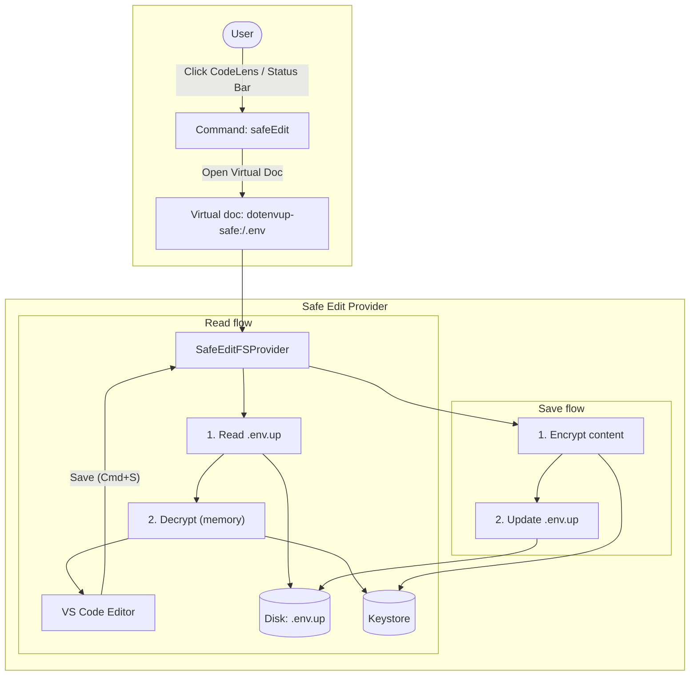
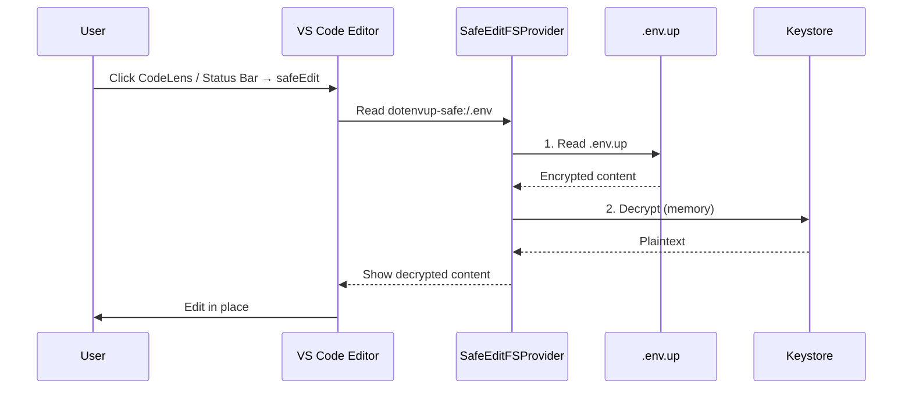
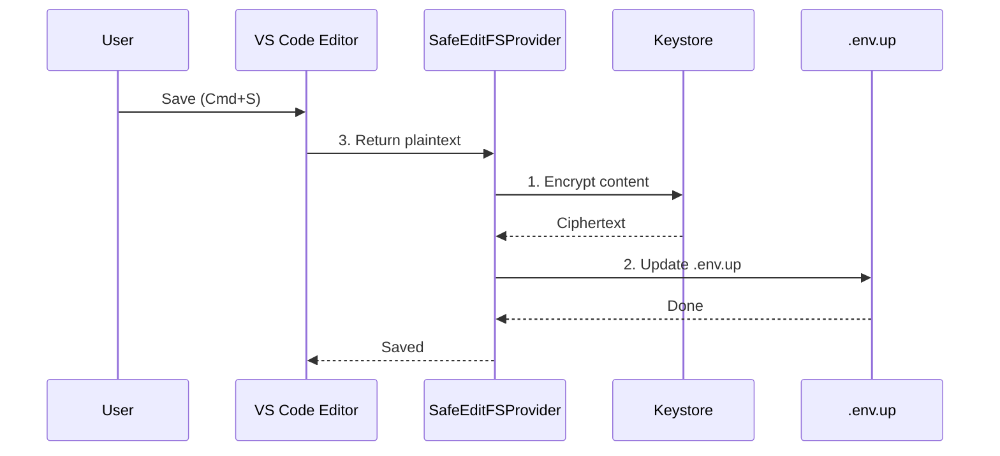

# Safe Edit — Edit `.env.up` in place

This feature lets you edit environment variables in a **virtual document** without writing a plaintext `.env` to disk. The extension decrypts on read and re-encrypts on save, using the Keystore; the real `.env.up` file stays encrypted at all times.

## Flow overview

## Read flow (open for editing)

When you open the virtual document (`dotenvup-safe:/.env`):

1. **SafeEditFSProvider** receives `Read dotenvup-safe:/.env`.
2. It **reads** the real `.env.up` file from disk.
3. It **decrypts** in memory using the **Keystore** (no plaintext file).
4. The decrypted content is shown in the **VS Code Editor**.

## Save flow (persist changes)

When you save (e.g. Cmd+S):

1. **Editor** sends the current plaintext to **SafeEditFSProvider**.
2. Provider **encrypts** the content via the **Keystore**.
3. Provider **writes** the result to **.env.up** on disk.

## Summary

| Step   | Where        | Action |
|--------|--------------|--------|
| Open   | SafeEditFSProvider | Read `.env.up` → Decrypt with Keystore → Show in editor |
| Edit   | VS Code Editor      | User edits; content stays in memory / virtual doc |
| Save   | SafeEditFSProvider | Encrypt with Keystore → Write to `.env.up` |

Plaintext never touches disk; only the encrypted `.env.up` file is stored.
