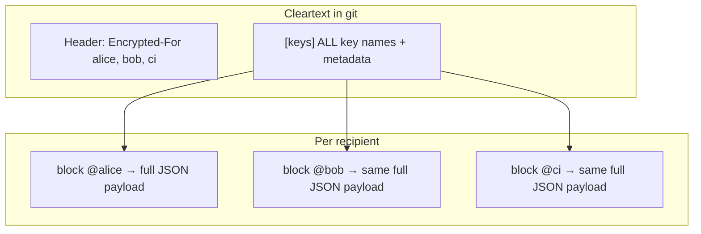

# DotEnvUp sharing model — what exists today

> **Status:** Describes **v1 behavior** (shipped). Per-key recipient ACL is **not implemented**.

---

## The short answer

| You want… | Supported today? | How |
|-----------|------------------|-----|
| Share **the whole** `.env.up` with Alice and Bob | **Yes** | Multi-recipient encryption |
| Share **only some keys** with Alice and other keys with Bob | **No** | Not in format or tools |
| Let Alice see **key names** but not values for keys she cannot decrypt | **No** | Key names are cleartext for everyone with repo access |
| One-off share of a single secret string | **Partial** | `sealedShare*` API in `@dotenvup/format` only — not wired into `.env.up` workflow |
| CI decrypts production secrets | **Yes** | Add CI public key as recipient; whole file |

**One `.env.up` file = one encrypted payload per recipient = all keys in that file.**

---

## How multi-recipient works (implemented)



1. **Encrypt once** — all `KEY=value` pairs (+ optional `_raw` .env text) → one JSON blob.
2. **Wrap symmetric key** separately for each recipient (`crypto_box_seal` per public key).
3. **Cleartext `[keys]`** lists every variable name, version, author, timestamp — visible without decrypting.

Crypto: `packages/format/src/crypto.ts` — `encrypt(entries, recipientPublicKeys, rawContent)` always encrypts the **full** `entries` map.

### Project workflow

| Step | Command / file |
|------|----------------|
| Store extra public keys | `.dotenvup.recipients.json` (public keys only, safe to commit) |
| Add recipient | `up recipients add <pub\|file> --label alice` |
| Re-encrypt file | **`up import .env`** (or extension Lock / Re-encrypt) — adding alone does **not** update `.env.up` |
| Recipient decrypts | `up unlock` with their own `~/.dotenvup/` key |

CLI: `packages/cli/src/commands/import.ts` calls `resolveRecipientPublicKeys()` on every import.

Extension: `reencryptEnvUp.ts`, `encryptForRecipient.ts`, `encryptForGitHub.ts` follow the same whole-file model.

---

## What is *not* implemented

### Per-key recipients

There is no:

- `[keys]` column for “encrypted for @alice only”
- Split files per audience (e.g. `.env.up.ops` vs `.env.up.dev`) as a first-class product feature
- Filtered decrypt (“Bob sees 3 of 20 keys”)

`author` in `[keys]` is **audit metadata** (who last changed a value), not **access control**.

### Per-key sharing workarounds (manual)

| Approach | Tradeoff |
|----------|----------|
| **Multiple `.env.up` files** | e.g. `.env.up` (app) + `.env.ops.up` (ops tokens). Each file has its own recipient list. Manual; extension multi-root helps status. |
| **Multiple repos** | Split secrets by trust boundary. |
| **UnknownPassword** (commercial) | Team sharing / governance on top of the format. |
| **`sealedShareEncrypt`** | One-off string to one public key; library-only, not `up` CLI UX. |

---

## Common confusion

### “I added a recipient but they still can’t decrypt”

`up recipients add` only updates `.dotenvup.recipients.json`. You must **re-encrypt**:

```bash
up unlock --duration 15m   # if needed
up import .env --delete    # or extension: Lock / Encrypt for Recipient
```

Until re-import, `.env.up` has no block for the new key.

### “Encrypt for GitHub User”

Adds their SSH Ed25519 key as **another full-file recipient** (converted to X25519). They get **all** secrets in that file, not a subset.

### Safe Edit and other recipients

When saving from Safe Edit, the extension must **re-encrypt for all recipients** listed in the existing file. That requires their public keys in `.dotenvup.recipients.json` (or only `@local` if you are the sole recipient). If other recipients’ pub keys were never saved locally, re-encrypt may drop them — see comments in `safeEditFSProvider.ts`.

### Cleartext metadata vs secrecy of key *names*

Anyone with git read access sees **which keys exist** (`DB_PASSWORD`, `GH_TOKEN`, …). Multi-recipient does not hide names from non-recipients; it only protects **values**.

---

## Tests and code pointers

| Area | Location |
|------|----------|
| Recipient config | `packages/format/src/recipientsConfig.ts` |
| Multi-recipient encrypt | `packages/format/src/crypto.ts` |
| CLI recipients | `packages/cli/src/commands/recipients.ts` |
| Sealed one-off share | `packages/format/src/sealedShare.ts` |
| User-facing steps | `docs/USER_GUIDE.md` — “Team recipient workflow” |

---

## Future (not committed)

Possible directions (see [FORMAT_V2.md](./FORMAT_V2.md) for metadata signing; per-key ACL would be a **separate** design):

- **Multiple named files** as first-class (ROADMAP 3.3)
- **Per-recipient sidecar** `.env.up.<recipient>` (FORMAT_SPEC v1 note)
- **UnknownPassword** policy: which keys which team member sees

**Per-key sharing within a single `.env.up`** would need format changes (multiple payloads or key-level blocks) and is **out of scope for v1**.
