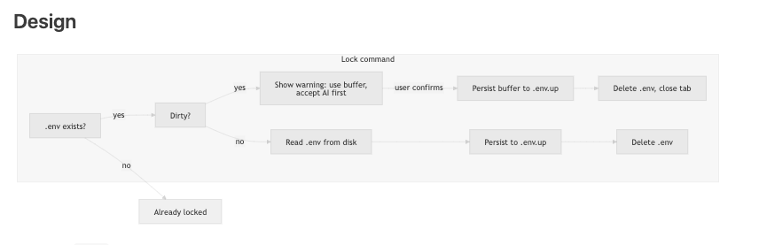

# Changelog

All notable changes to the DotEnvUp extension will be documented in this file.

## [Unreleased]

### Changed

- **Key storage status copy** — Reflects encrypted `identity.enc` envelope + wrapping key; notes that macOS Touch ID is not shipped yet. CLI identity changes land with `@dotenvup/cli` / `@dotenvup/format` (see [RELEASE_NOTES_IDENTITY_ENVELOPE.md](../../docs/RELEASE_NOTES_IDENTITY_ENVELOPE.md)). Existing users: `up key upgrade`.

## [0.6.2] - 2026-03-06

### Fixed

- **Root-level `.env` always detected** — The extension now always checks each workspace folder root for `.env` and `.env.up` using the filesystem, in addition to workspace search. Previously, root-level `.env` could be missed when it was excluded from search (for example in `.gitignore` or `search.exclude`), so the status bar did not show unprotected state or the protect flow. Opening a project with only a plain `.env` in the root now reliably shows the status bar and protect action.

### Tests

- **Workspace detection** — Added test coverage for workspace-root `.env` and `.env.up` detection even when search misses root files.

## [0.6.1] - 2026-03-06

### Fixed

- **Marketplace/Open VSX packaging metadata** — Replace an invalid extension keyword tag so the release can be published successfully to the stores.

## [0.6.0] - 2026-03-06

### Added

- **Encrypt for GitHub User** — Add a GitHub user's Ed25519 SSH key as a recipient for `.env.up` directly from the extension.
- **Decrypt Sealed File** — Open and decrypt standalone `.sealed` files with your local DotEnvUp keypair.
- **Receive Encrypted Share** — Guided receive flow for encrypted shares, including sealed-box share payloads.
- **Copy MCP config for Cursor** — New helper command copies ready-to-paste Cursor MCP configuration for `@dotenvup/mcp`.

### Changed

- **GitHub recipient flow now follows the `.env.up` standard** — the command adds the GitHub user as a recipient and re-encrypts `.env.up` instead of creating a separate share file by default.

### Tests

- **Crypto/share coverage** — Added tests for sealed-share encryption/decryption, wrong-key failure, OpenSSH Ed25519 parsing, Ed25519-to-X25519 conversion, and command registration for the new extension commands.

## [0.5.1] - 2026-03-05

### Fixed

- **Changelog packaging** — Previous VSIX was packaged before the changelog was updated. No code changes; this release fixes the bundled changelog on the marketplace.

## [0.5.0] - 2026-02-28

### Added

- **Copy My Public Key** — New command copies your base64 public key to the clipboard with key fingerprint. Share it with a teammate so they can encrypt for you.
- **Encrypt for Recipient** — New command adds a recipient's public key to `.env.up` and re-encrypts. Works in both locked and unlocked states. Accepts key from clipboard (base64) or file.
- **Context menu sharing** — Right-click any `.env.up` in the explorer → **Copy My Public Key** or **Encrypt for Recipient** (in a dedicated "Sharing" group).
- **Status bar sharing options** — "Copy My Public Key" and "Encrypt for Recipient..." appear in the status bar Quick Pick menu (both single-location and multi-location).
- **Always-visible status bar** — Status bar item is always visible, even when no `.env` or `.env.up` files exist. Shows an idle state with Init and Import options for new projects and monorepos.

### Hardening

- **Atomic re-encryption** — `reencryptLocked` writes to a temp file then renames, preventing partial writes on crash.
- **Post-write verification** — After re-encrypting, the new file is verified (decryptable with your key) before replacing the original. If verification fails, the original `.env.up` is preserved.
- **Zero-entries guard** — Re-encryption aborts if the decrypted content has zero entries, preventing silent data loss.

## [0.4.6] - 2026-02-27

### Added

- **Context menu: Lock, Unlock, Safe Edit** — Right-click any `.env.up` in the explorer or editor tab → **Lock**, **Unlock to Disk**, or **Edit with DotEnvUp (Safe Edit)**. Each operates on the specific file you clicked.
- **Full multi-root workspace scanning** — All workspace folders and subfolders are scanned for `.env` and `.env.up` files, not just the active editor's folder. Fixes files not appearing in the Quick Pick in large multi-root workspaces.

### Fixed

- `.env.up` files in subdirectories of multi-root workspaces (e.g. `avatarrooms-agent/`) now appear correctly in the status bar Quick Pick.

## [0.4.5] - 2026-02-26

### Added

- **Partially protected** — When both `.env` and `.env.up` exist in the same folder, status bar shows "Partially protected" (with tooltip "both .env and .env.up — lock to remove .env") instead of "All protected". "All protected" is shown only when all such locations are locked.
- **Unlock with merge** — If `.env` already exists when you Unlock, you can choose "Use .env (e.g. local/agent)" or "Use .env.up (e.g. from team)". Merged content is written to both `.env` and `.env.up`.
- **Safe Edit with merge** — When opening Safe Edit and `.env` exists, you can merge (prefer `.env` or `.env.up`). After saving, you are prompted "Remove .env from disk?" to clean up.
- **Tests** — Safe Edit edge cases: readFile with `merge=env` when `.env` exists vs removed (fallback), wrong-key decryption, writeFile when `.env.up` was deleted, stat when `.env.up` is missing. Merge utility unit tests.

### Fixed

- Safe Edit virtual FS now correctly throws file-not-found style errors (EntryNotFound) when `.env.up` is missing on stat or when saving after the file was deleted; tests updated to match VS Code error messages.

## [0.4.1] - 2026-02-25

### Fixed

- **Lock and editor tab** — When Lock deletes `.env`, the extension now closes the `.env` editor tab *before* deleting the file. This prevents VS Code/Cursor from showing the confusing "Do you want to save the changes you made to .env?" dialog after lock (all code paths: lock from buffer, lock from disk, re-encrypt and lock).

### Added

- **Tests** — Lock tests now assert that the `.env` tab is closed after lock (dirty buffer path and new "lock from disk closes tab" test).

### Documentation

- **User Guide** — New subsections: "Sharing with one other person" (step-by-step), "Using the VS Code / Cursor extension" (status bar, commands, First Protect, Import All, settings pointer). Updated: first-time setup (no .env yet), team workflow (how to get public key), recipients add (path or base64).
- **dotenvup.com** — New "Supported use cases" section with instruction-style bullets (first-time, daily work, run without file, move machine, edit secrets, sharing with one person, team recipients, recover key, VS Code/Cursor). Link to User Guide for full steps.

## [0.4.0] - 2026-02-25

### Added

- **Lock from buffer (unsaved)** — When `.env` is open with unsaved changes, Lock shows a warning: *"Lock will save your current editor content to .env.up and remove .env. If you have unaccepted AI or other edits, accept or reject them first."* You can choose **Lock current content** to persist the editor buffer to `.env.up` and delete `.env` (the tab is closed). No more losing new keys when auto-lock runs before you save.
- **Lock = always update .env.up then delete** — Lock no longer prompts "Save to .env.up & Lock" on drift. It always writes the current `.env` (from disk or, when dirty, from the editor buffer after you confirm) to `.env.up`, then deletes `.env`. Backup (`createBackupBeforeLock`) remains the safety net.

### Lock command flow

## [0.3.0] - 2026-02-24

### Added

- **Lock with drift: Save & Lock** — When `.env` has changes not saved to `.env.up`, Lock now offers only "Save to .env.up & Lock" or "Cancel". Choosing Save & Lock runs Import (preserves your changes into `.env.up`) then locks. No option to discard changes.
- **Drift check on auto-lock** — Timer auto-lock no longer deletes `.env` when it has unsaved-to-.env.up changes. It skips the lock and logs so you can Import then Lock manually.
- **Drift check on close** — Closing VS Code/Cursor no longer deletes `.env` when it has unsaved-to-.env.up changes. `.env` is left in place with a log message.
- **Tests** — New test suite "Lock with drift" (Save & Lock preserves changes, Cancel leaves files unchanged, dialog has no discard option). Runs when `@dotenvup/format` is loadable.
- **Safety audit** — `packages/vscode-dotenvup/docs/ENV_DELETION_SAFETY_AUDIT.md` documents every code path that can delete or overwrite `.env` and its guard.

### Fixed

- **Data loss prevention** — Lock could previously offer "Lock (discard changes)", which would delete a saved `.env` and lose new lines. That option is removed; the only way to lock when there is drift is to save first (Save to .env.up & Lock).
- **Auto-lock and deactivate** — They previously deleted `.env` after a timer or on close without checking drift, so users could lose data if they had edited `.env` and not run Import. Both paths now check drift and skip deletion when `.env` has changes not in `.env.up`.

## [0.1.2] - 2026-02-24

### Added

- **Key bundle management** — New commands:
  - `DotEnvUp: Export key bundle`
  - `DotEnvUp: Import key bundle`
  - `DotEnvUp: Key Storage Status`
- **Storage mode setting** — Added `dotenvup.keyStorageMode` (current supported mode: `user-file`).

### Fixed

- **Security hardening** — Removed runtime debug/telemetry instrumentation remnants.
- **Deactivation safety** — `deactivate` now uses robust fail-closed safety verification before `.env` deletion.
- **Docs alignment** — Updated security and troubleshooting docs to match actual file-based key storage model.

## [0.1.1] - 2026-02-24

### Added

- **Encrypted backups** — Optional setting `dotenvup.createBackupBeforeLock` to create encrypted `.env.up.bak-<timestamp>` backups before locking.
- **Encrypt All** — Optional setting `dotenvup.encryptAllEnvFiles` to protect all `.env.*` files in the project (e.g. `.env.local`, `.env.test`), not just the main `.env`.
- **Import All command** — New command `DotEnvUp: Import all .env.* files` to bulk-encrypt all plaintext env files in the workspace.
- **Key bundle export/import** — New commands to export and import passphrase-protected key bundles.
- **Key storage status** — New command and setting for explicit storage mode visibility (`user-file`).

### Fixed

- Removed debug/instrumentation runtime calls from extension paths.
- Hardened deactivate flow to use fail-closed safety verification before deleting `.env`.

## [0.1.0] - 2026-02-23

### Added

- **First Protect popup** — Consent-based onboarding: explains local encryption, key storage, and offers UnknownPassword promo before first protect.
- **Comment preservation** — `.env` comments, blank lines, and structure are now encrypted alongside values and restored on unlock. No more losing `# Database` sections or commented-out secrets.
- **Forever unlock** — "Forever (no auto-lock)" option in the unlock duration picker.
- **Shared keystore** — Keys stored at `~/.dotenvup/identity` (works across VS Code, Cursor, CLI, and any editor). Legacy VS Code Secret Storage keys are auto-migrated.
- **Safety guards on every deletion path** — `isSafeToDelete` check before *any* `.env` removal (lock, auto-lock timer, deactivate, import). Backups created before deletion.

### Changed

- **Keypair storage moved** from VS Code Secret Storage to `~/.dotenvup/identity` (cross-IDE, cross-tool).
- **Import flow** now auto-detects `.env` in workspace root (no file picker needed for the common case).
- **Lock command** includes drift detection, decrypt-before-delete verification, TOCTOU recheck, and pre-deletion backup.

### Fixed

- `.env` could be silently deleted without a valid `.env.up` during deactivate or auto-lock — now blocked with safety checks.
- Key regeneration no longer happens silently; the consent popup always appears when no key exists.

## [0.0.1] - 2026-02-15

### Added

- **Lock / Unlock** — Encrypt and decrypt `.env.up` files with one click. Status bar shows lock state.
- **Init** — Generate a local keypair.
- **Import** — Convert an existing `.env` file to encrypted `.env.up`.
- **Show Keys** — View key metadata (names, versions, timestamps) without decryption.
- **Status** — See lock state, key count, and stale key warnings.
- **Safety** — Drift detection, decrypt-before-delete, confirmation dialogs, atomic writes, overwrite protection.
- **Multi-root** — Support for workspaces with multiple folders; quick-pick when several have `.env.up`.
- **Settings** — `confirmOnLock`, `defaultUnlockDuration`, `staleDays`, `autoLockOnClose`.
- **File type** — `.env.up` and `.up` with custom icon and syntax highlighting.
